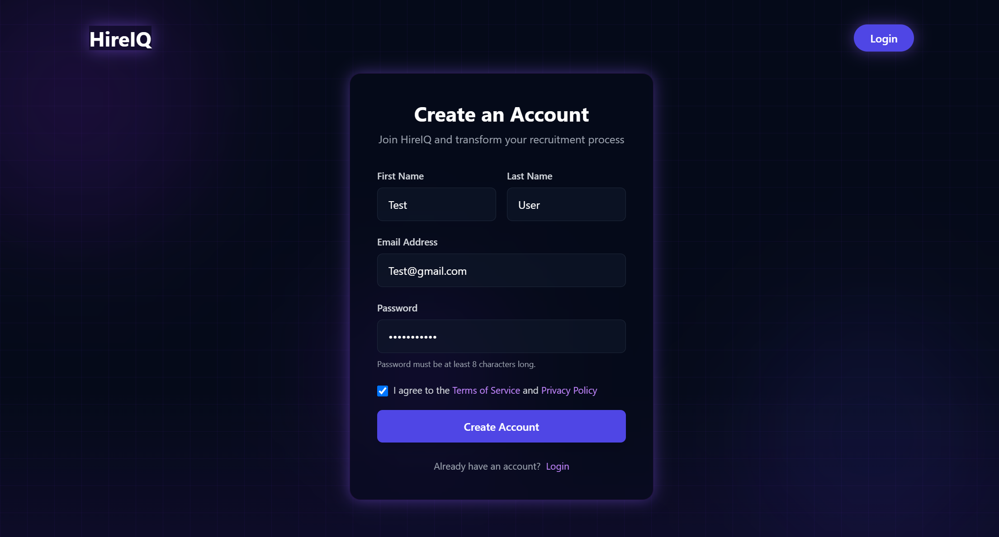
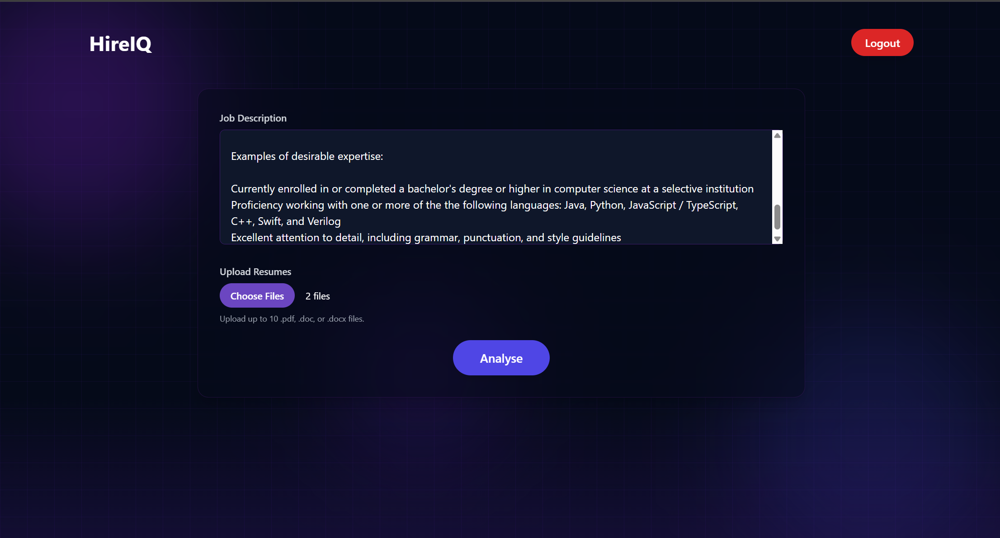
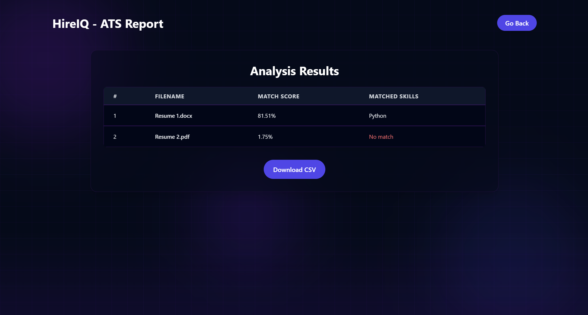
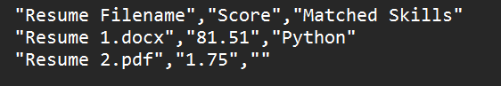

# 📊 HireIQ – An AI-Powered Candidate Tracking System

HireIQ is an intelligent Applicant Tracking System (ATS) that streamlines recruitment by leveraging AI to analyze resumes against job descriptions. It provides a user-friendly interface for uploading job descriptions and resumes, processes them using a Python-based AI script, and presents ranked candidates based on relevance.

---

## 🚀 Features

- **AI-Driven Resume Analysis**: Utilizes a Python script to evaluate and rank resumes based on their similarity to the provided job description.
- **Bulk Resume Upload**: Supports uploading up to 10 resumes for efficient and fast processing.
- **Dynamic Results Display**: Presents analysis results in an interactive and visually appealing format.
- **CSV Export**: Allows downloading analysis results in CSV format for record-keeping or further analysis.
- **Modern UI**: Built with Tailwind CSS to ensure a responsive and clean user interface.

---

## 🛠️ Tech Stack

- **Frontend**: EJS Templates, Tailwind CSS
- **Backend**: Node.js, Express.js
- **AI Processing**: Python (for resume analysis)
- **Database**: MongoDB
- **File Uploads**: Multer

---

## 📂 Project Structure

```
candidate-tracker-ai/
├── Controllers/          
│   └── userController.js        # User authentication controller
├── Routes/               
│   ├── jobRouter.js             # Resume processing routes
│   ├── pageRouter.js            # Page navigation routes
│   └── userRouter.js            # User auth routes
├── db/                   
│   └── ConnectDb.js             # Database connection setup
├── images/               
│   ├── favicon.ico              # Site favicon
│   ├── Home_Page.png            # UI screenshots
│   ├── Login.png
│   ├── Resume_Analysis.png
│   ├── Resume_CSV.png
│   ├── Signup.png
│   └── Uploading_Files.png
├── models/               
│   └── userModel.js             # User data model
├── node_modules/         # Node.js dependencies
├── python/               
│   ├── models/                  # Python ML models directory
│   ├── utils/                   
│   │   ├── __pycache__/         # Python cache files
│   │   ├── ranker.py            # Resume ranking algorithm
│   │   └── resume_parser.py     # PDF/DOCX parsing utilities
│   ├── main.py                  # Main Python entry point
│   └── README.md
├── SampleResumes/        # Sample resume files directory
├── temp/                 
│   └── jd-1744250547834.txt     # Temporary job description file
├── uploads/              
│   └── Resume 2.pdf             # Uploaded resume file
├── utils/                
│   ├── __pycache__/             # Python cache files
│   ├── csvUtils.js              # CSV export utilities
│   ├── isLoggedIn.js            # Auth middleware
│   ├── redirectifLoggedIn.js    # Auth redirect utility
│   └── upload.js                # File upload configuration
├── views/                
│   ├── home.ejs                 # EJS view templates
│   ├── login.ejs
│   ├── main.ejs
│   ├── results.ejs
│   └── signup.ejs
├── .env                  # Environment variables
├── .gitignore            # Git ignore configuration
├── app.js                # Main Node.js application file
├── package-lock.json     # Node.js dependency lock file
├── package.json          # Node.js project configuration
├── README.md             # Project documentation
├── requirements.txt      # Python dependencies
```

---

## Screenshots

**Home Page**


**Login Screen**


**Signup Screen**


**Upload File**


**Resume Analysis**


**CSV File**



---

## ⚙️ Installation & Setup

1. **Clone the Repository**

   ```bash
   git clone https://github.com/Sahib17/candidate-tracker-ai.git
   cd candidate-tracker-ai
   ```

2. **Install Node.js Dependencies**

   ```bash
   npm install
   ```

3. **Install Python Dependencies**

   Ensure you have Python installed, then:

   ```bash
   pip install -r requirements.txt
   ```

4. **Configure Environment Variables**

   Create a `.env` file in the root directory and add:

   ```env
   MONGO_URI=your_mongodb_connection_string
   ```
   ```env
   JWT_SECRET=your_Secret_Key
   ```


5. **Start the Application**

   ```bash
   npm start
   ```

6. **Access the Application**

   Open your browser and navigate to:

   ```
   http://localhost:8080
   ```

---

## 📈 Usage

1. **Upload Job Description and Resumes**
   - Navigate to the upload page.
   - Enter the job description.
   - Upload one or multiple resumes in PDF format.

2. **Process Resumes**
   - Click on the 'Analyze' button.
   - The system will process the resumes and display a ranked list based on relevance.

3. **Download Results**
   - Click on the 'Download CSV' button to export the analysis results.

---

## 🧪 Sample Data

For testing purposes, you can use the sample resumes provided in the `SampleResumes/` directory.

---

## Developed by:
Manpreet Singh (300206509)

Sahibjeet Singh (300206168)

Shreyas Dutt (300206165)

